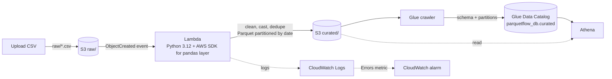

# Architecture

```mermaid
flowchart LR
    U[Upload CSV] -->|raw/*.csv| RAW[(S3 raw/)]
    RAW -->|ObjectCreated event| L[Lambda<br/>Python 3.12 + AWS SDK for pandas layer]
    L -->|clean, cast, dedupe<br/>Parquet partitioned by date| CUR[(S3 curated/)]
    CUR --> GC[Glue crawler]
    GC -->|schema + partitions| CAT[(Glue Data Catalog<br/>parquetflow_db.curated)]
    CAT --> A[Athena]
    CUR -.read.-> A
    L -.logs.-> CW[CloudWatch Logs]
    CW -.Errors metric.-> AL[CloudWatch alarm]
```

The Lambda role may read `raw/*` and write `curated/*` only. The Glue crawler role may read `curated/*` only.
